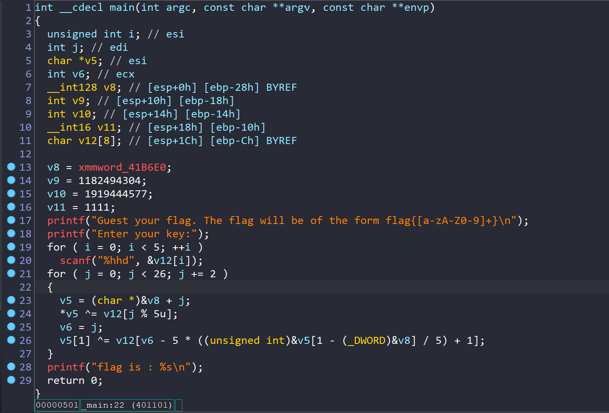

#BabyRE Writeup

###Overview

Đầu tiên kiểm tra file thì thấy đây là file thực thi PE32 của Windows 


**Chạy thử chương trình**


Thấy rằng chương trình bắt nhập key, nhập đúng sẽ cho ra flag. Load file vào IDA32 để phân tích 



Sau khi load file vào IDA thì có thể thấy biến local `v8`, `v9`, `v10`, `v11` lưu vào 1 chuỗi ký tự dùng để xử lý, tính toán với key để ra flag. Input nhập vào là 5 số, mỗi số sẽ có kiểu dữ liệu `text` 1 byte.
Sau khi biến đổi code 


-Khi nhập input thì chuỗi v8 = ``bdnpQai|nufimnug`n{Fafhr`` sẽ được biến đổi cùng với input nhập vào. Các ký tự chẵn của chuỗi `v8` sẽ được xor lặp 5 lần, lần lượt theo thứ tự `0 2 4 1 3`. Vì output là của flag có dạng `flag{[a-zA-Z0-9]+}` nên 5 ký tự đầu của flag sẽ là `flag{` 
=> 3 ký tự vụ trí `0` `2` `4` của input sẽ là 
```py
ord('b') ^ ord('f') =  4 
ord('n') ^ ord('a') = 15
ord('Q') ^ ord('{') = 42
```
Ở phần encode flag 
```py
    v5 = &v8[j];
    *v5 ^= v12[j % 5u];
    v6 = j;
    v5[1] ^= v12[v6 - 5 * ((unsigned int)&v5[1 - (_DWORD)&v8] / 5) + 1];
```
Vì encode sử dụng phép xor nên có thể đoán được do đã có format của flag bằng cách xor ngược lại 
```py
ord('l') ^ ord('d') =  8
ord('g') ^ ord('p') = 23
```
>key = 4 8 15 23 42

`flag{easy_baby_challenge}`